# Dojo Next.js

# Version française

## Introduction

Bonjour et bienvenue dans ce dojo intitulé "Créer des applications Full Stack avec Next.js" !

Dans ce dojo, nous vous montrerons une stack qui est, selon nous, l'une des meilleures stack en ce moment en matière de Developer eXperience.
L'application que nous créerons ensemble a un but assez simple : pouvoir se créer des listes de vos films favoris. Cependant pour que cela soit un peu plus amusant,
nous irons de bout en bout : de la conception au déploiement, et ceci en seulement quelques heures ! Merci Next.js ;)

## Prérequis

[pnpm](https://pnpm.io/fr/installation)

## Etape 1 : concept(ion)

Je suis un utilisateur lambda un peu tête en l'air, et j'aime beaucoup regarder des films, mais je ne sais jamais lequel regarder parce que j'ai tendance à oublier ceux que j'ai apprécié ! Si seulement j'avais une application pour me créer des listes des films que j'ai adoré et les noter... Mais en fait, ce n'est pas si dur que ça !

Pour éviter de devoir rentrer nous mêmes tous les films, utilisons la (très utilisée dans les tutoriels) fameuse [API de la Movie Database](https://developers.themoviedb.org/3/getting-started).
Celle-ci nous permettra d'afficher une superbe interface dans laquelle choisir les films plutôt que de devoir tout réécrire nous-mêmes.

On pourrait très bien imaginer une page de connexion, une page d'accueil dans laquelle une liste aléatoire (ou non) de films sont affichés avec une possibilité de les ajouter dans une liste et de les noter, et une page pour choisir une de vos listes et afficher les films correspondants.

Tout d'abord il nous faut une base de données pour stocker nos listes de films et leurs notes. En réalité, pour une utilisation aussi simple, vous pourriez choisir presque n'importe quel moteur de base de données, mais par préférence nous utiliserons PostgreSQL dans ce dojo. Pour vous éviter de setup une base de données vous-mêmes, nous profiterons de l'offre gratuite de [Neon](https://neon.tech), qui fait du PostgreSQL managé avec une offre gratuite assez généreuse.

Voici le schéma qui me vient à l'esprit quand je pense à la base de données de cette application (bien évidemment, cela peut être fait de multiples manières différentes):

Pour faire communiquer notre interface et notre base de données, nous utiliserons [Prisma](https://www.prisma.io/). Prisma est un ORM pour TypeScript qui gère les migrations, le modèle de votre base de données, mais aussi la sécurité des types (type-safety) et l'autocomplétion, que nous aimons beaucoup chez les devs TypeScript.

Nous utiliserons aussi [tRPC](https://trpc.io/). C'est probablement la technologie la moins "connue" de la stack et pourtant c'est une petite merveille ! tRPC nous aidera à faire une API qui relie notre interface directement à nos données de manière type-safe, en utilisant la puissance de l'inférence de TypeScript et notre IDE préféré VSCode pour pouvoir aller très vite dans le développement de nos fonctionnalités sans rien casser.

Enfin, pour nous authentifier, nous utiliserons [NextAuth.js](https://next-auth.js.org/) avec un provider externe. Dans ce dojo nous utiliserons GitHub en tant que provider, mais NextAuth supporte de nombreux providers, et permet même d'en ajouter un nous-même.

Une fois que vous avez digéré toutes ces informations, il est l'heure de préparer le terrain.

## Etape 2 : préparation des différents services, providers, et installation du boilerplate.

### Neon : un PG managé en deux minutes chrono.

Comme dit précédemment, nous avons besoin d'une base de données. Cependant, ceci étant un dojo, je ne vais pas commencer à vous expliquer comment setup une base avec Docker, ou vous demander de setup une base managée payante. Notre moteur préféré (PostgreSQL, bien évidemment) est disponible en version managée, avec une offre gratuite largement suffisante pour nos besoins actuels, chez [Neon.tech](https://neon.tech) !

Utilisez votre navigateur favori (Firefox master race. Pas de discussion.) pour naviguer sur la page d'accueil de Neon :

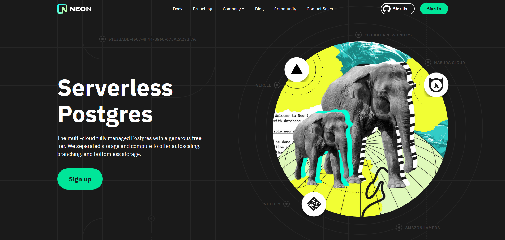

Cliquez sur le gros bouton "Sign up" en plein milieu de la page.

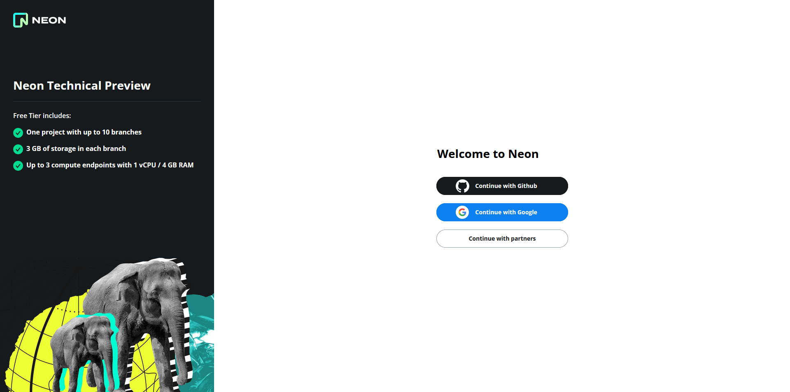

Utilisez le provider que vous voulez. Vous arriverez sur cette page :

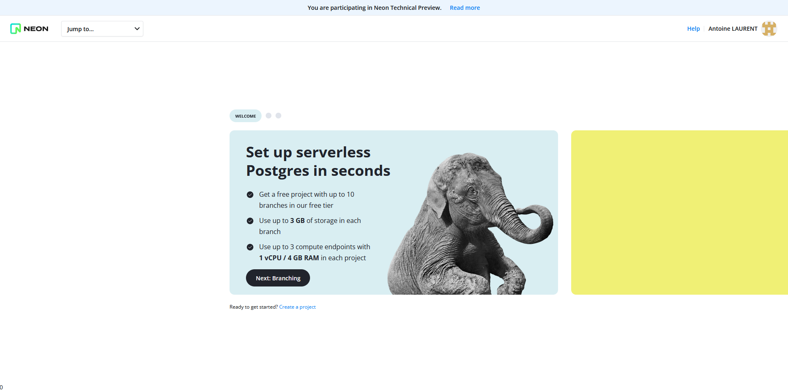

Créez un projet et donnez-lui le nom que vous voulez.
On n'oublie pas la localisation de la DB qui nous donne de meilleures performances et qui limite (un peu...) la perte de souveraineté de nos données au profit de nos collègues américains.

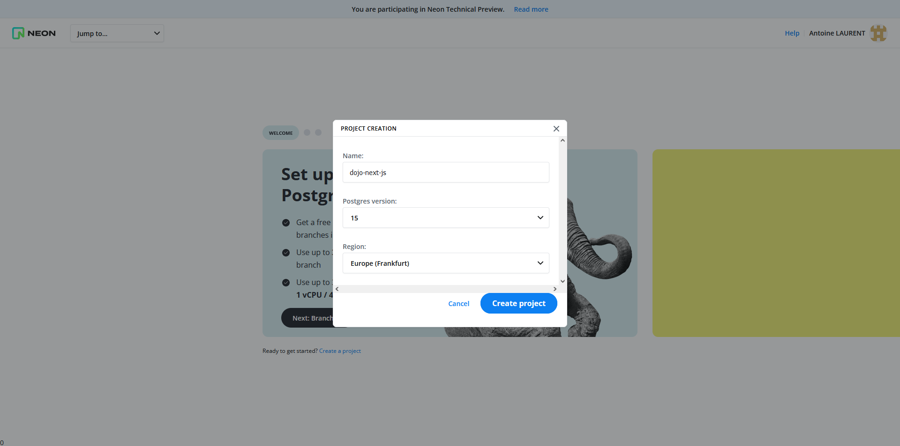

Une fois ceci fait, vous pouvez accéder à votre base de données grâce à la chaine de connexion fournie par Neon. Patientez un petit peu, nous voulons d'abord configurer une branche de développement.
Naviguez vers la section "Branches" de l'interface et créez une branche "dev".

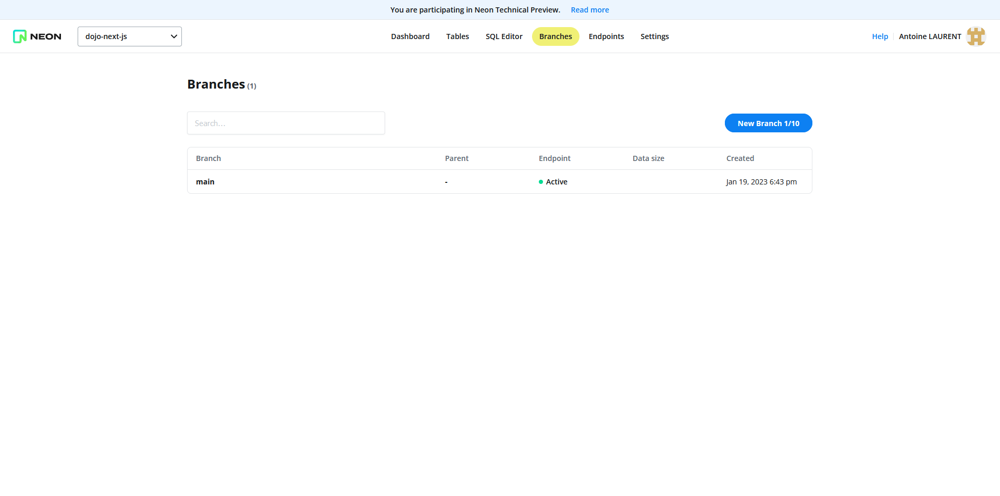

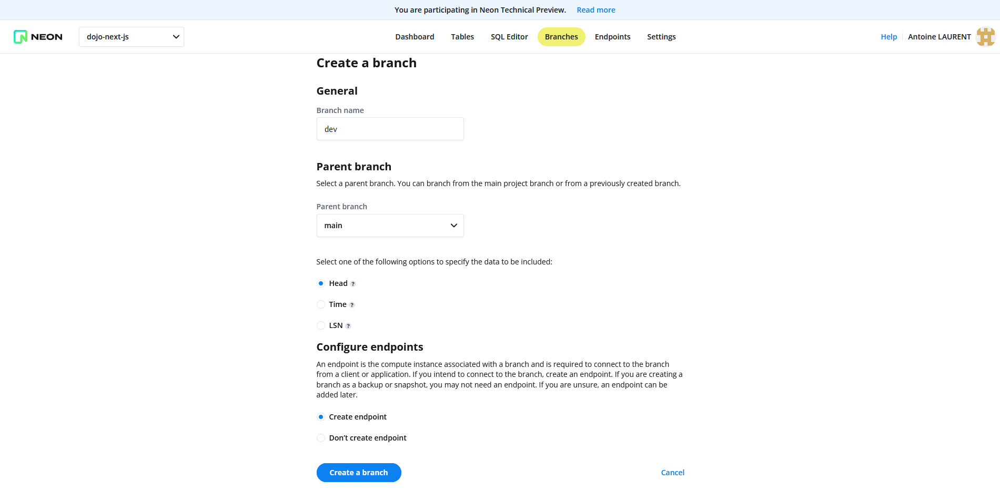

Retournez au niveau de la section "Branches" de l'interface et constatez la création de la branche "dev".

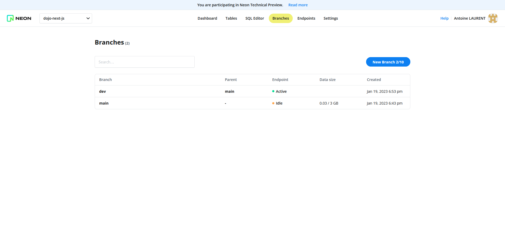

Pour utiliser Prisma avec Neon, il est aussi nécessaire de créer une "shadow database" côté Neon.
Cette seconde base de données permet à Prisma de détecter les différences de schéma lors des migrations.

Rendez-vous donc dans l'onglet "Tables" de l'interface et dans "Database", sélectionnez "Create new database".
Donnez-lui un nom et cliquez sur créer. Récupérez l'URL de connexion.

Pour plus d'informations vous pouvez aussi suivre ce guide (anglais) :
https://neon.tech/docs/guides/prisma

Votre base de données est prête à être utilisée. Nous configurerons le lien à celle-ci un peu plus tard.

### Création de compte TMDB

Pour utiliser l'API de TMDB, il faut se créer un compte utilisateur sur le site TMDB.
Rendez-vous sur https://www.themoviedb.org/signup et créez un compte.
**Entrez un email valide car vous devrez valider son existence.**

Une fois votre compte créer, il faut faire une demande de clé API : https://www.themoviedb.org/settings/api/new?type=developer.
Celle-ci devrait être automatiquement acceptée, mais il est vous de même demandé de renseigner pourquoi vous souhaitez utiliser l'API.

Pour remplir le formulaire, choisissez :
Type of use : Personal

Entrez un nom qui vous convient et en URL vous pouvez renseigner l'url `localhost:3000`.
Mettez une petite description de pourquoi vous souhaitez utiliser l'application (par exemple: `To participate to a dojo about nextjs`)

Vous devez ensuite renseigner des informations personnelles.
A vous de choisir si vous souhaitez remplir avec des vraies infos ou du lorem ipsum. Aucune vérification n'est effectuée derrière.

Après avoir soumis le formulaire vous devriez avoir accès à vos clés d'API.
Pour ce tutoriel nous aurons besoin de `API Read Access Token (v4 auth)`.

### De l'authentification très rapidement à l'aide du provider GitHub.

NextAuth nous permet de mettre en place de l'authentification sur notre application très facilement avec OAuth. Pour pouvoir faire cela cependant, il nous faut un provider. Vous avez très certainement un compte GitHub, nous utiliserons donc ce provider, cependant il est possible d'utiliser Google, Discord, et même Slack ! ;)
Vous pouvez aussi utiliser un provider maison.

Il nous faudra répertorier deux applications chez GitHub : une application locale pour le développement, et une application pour la production.

Répertorions ensemble l'application pour le développement à [cette adresse](https://github.com/settings/applications/new).

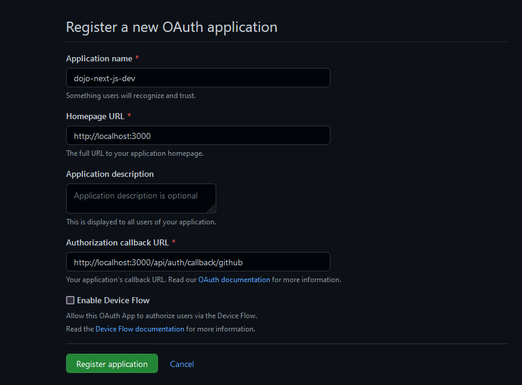

Ceci nous permettra de nous authentifier même en local.

GitHub vous redirige vers une page sur laquelle vous trouverez le "client ID" de votre application, et pourrez générer un nouveau "client secret".

Nous ferons la même opération pour votre application en production un peu plus tard.

### Installation du boilerplate de notre application à l'aide de create-t3-app

Pour cette application, nous utiliserons la [T3 stack](https://create.t3.gg/) (sans Tailwind, je ne suis pas un grand fan de Tailwind. Peut-être un jour ?). Nous avons déjà explicité les différents modules présents dans la T3 stack plus haut : Next.js, Prisma, NextAuth, tRPC, TypeScript (T3 vient de TypeScript, tRPC, Tailwind).

Pour lancer une application T3, utilisons pnpm dans le dossier de votre choix :

`pnpm create t3-app`

Le CLI vous guide, configurez votre boilerplate comme ceci :

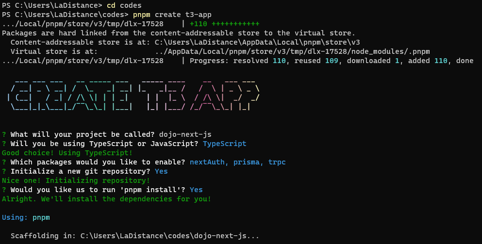

### Configuration des outils

Plus qu'un peu de configuration et nous pourrons commencer à développer notre application.

#### Variables d'environnement

Dupliquez le fichier `.env.example` à la racine de ce repository et renommez le en `.env`.

##### Base de donnnées

Pour les liens de base de données, rendez-vous sur l'interface "Dashboard" de Neon et récupérez les "Connection string" des 2 bases de données (classique et shadow). Celles-ci devraient avoir cette forme `postgres://{username}@{host}/{dbname}`.
Il manque donc le mot de passe et si vous ne l'avez pas noté lors des précédentes étapes de configuration, vous pouvez facilement le réinitialiser.
Une fois le mot de passe en votre possession, modifier les "Connection string" pour qu'elles aient la forme suivante : `postgres://{username}:{password}@{host}/{dbname}`.
Renseignez-les après le `=` des variables d'environnement explicitement nommées `DATABASE_URL` et `SHADOW_DATABASE_URL`.

##### API TMDB

Renseignez la clé d'API `API Read Access Token (v4 auth)` après `TMDB_BEARER_TOKEN=`.
Pour l'URL : `TMDB_API_BASE_URL=https://api.themoviedb.org/3`.

##### Next Auth

Nous utiliserrons l'URL d'authentification suivante `NEXTAUTH_URL=http://localhost:3000`.

## Déploiement Vercel

### Création et configuration de compte

- Créer un compte chez Vercel : https://vercel.com. Avec votre compte GitHub vous pourrez directement donner accès à vos repositories à Vercel.
  - Si authentification avec GitHub (ou autre site de contrôle de version) : autorisez tout ou partie de vos repositories.
  - Si authentification par mail : vous pourrez donner l'URL d'un repository via son URL publique.
- Créer un nouveau projet : https://vercel.com/new

  - Si authentification par mail, cliquez sur "Import Third-Party Git Repostiory", et entrez l'URL publique du repository souhaité.
    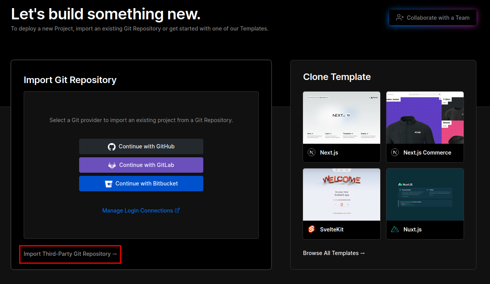

  - Si authentification par GitHub, importez le repository souhaité via le bouton "import" en face du nom du repository, ou ajoutez le via les droits accordés à Vercel.
    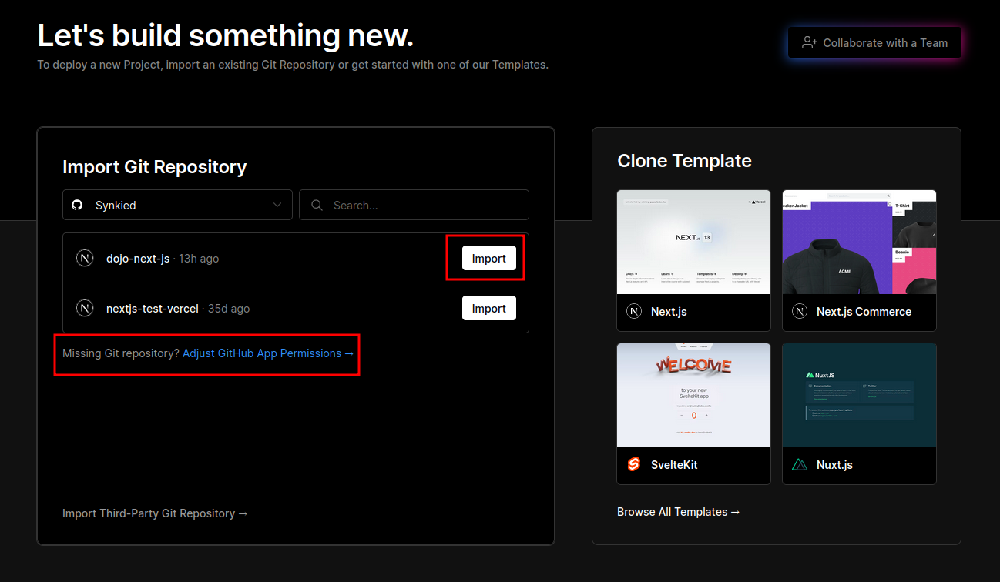

### Configuration du projet

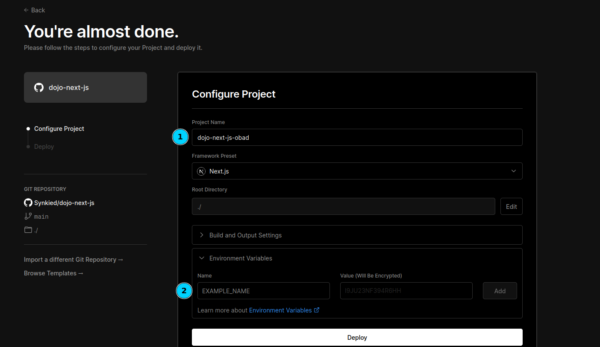

1. Nommez votre project comme bon vous semble. A noter que ce sera l'URL de votre projet (en version Hobby), où l'URL sera de la forme : https://{project_name}.vercel.app/
2. Insérez vos variables d'environnement qui se trouvent dans le fichier `.env` précédement configuré.  
   La variable `NEXTAUTH_URL` n'est pas nécessaire quand le déploiement est sur Vercel.  
   Il faut cependant en créer une autre : `NEXTAUTH_SECRET`.  
    **Veuillez suivre cette documentation pour en comprendre d'avantage : https://next-auth.js.org/deployment#vercel**

Une fois ces étapes effectuées, cliquez sur "Deploy".  
Vous pourrez suivre l'état d'avancement du déploiement et serez notifié d'une erreur ou du succès de l'opération.

Si tout se passe bien vous aurez accès à votre application déployée.

_Toutes ces opérations peuvent être effectuées via la CLI de Vercel : https://vercel.com/docs/cli/deploying-from-cli_
